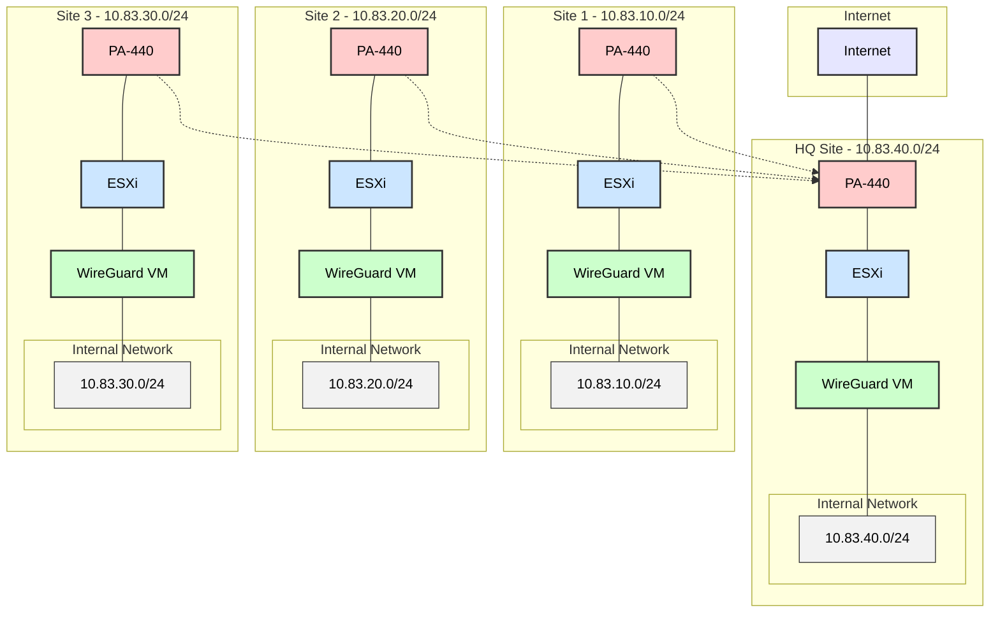

# Enterprise WireGuard Site-to-Site VPN Implementation Guide

## Overview

This guide provides enterprise-grade implementation steps for a hub-spoke WireGuard VPN deployment across multiple sites using PA-440 firewalls and ESXi virtualization. The architecture ensures secure, encrypted communication between sites while maintaining centralized internet access through HQ.

## Security Notice

This implementation follows enterprise security best practices:
- Network segmentation with DMZ isolation
- Principle of least privilege
- Encrypted inter-site communication
- Centralized internet access control
- Protected management networks

## Architecture



## Network Design

### Address Allocation

| Site | Network Range | Purpose |
|------|--------------|----------|
| HQ | 10.83.40.0/24 | Central hub, internet access |
| Site 1 | 10.83.10.0/24 | Branch office |
| Site 2 | 10.83.20.0/24 | Branch office |
| Site 3 | 10.83.30.0/24 | Branch office |

### Key Components

| Component | Purpose | Configuration |
|-----------|----------|---------------|
| PA-440 | Next-gen firewall | Security policies, NAT, routing |
| ESXi | Virtualization | VM hosting, network isolation |
| WireGuard VM | VPN endpoint | Ubuntu 22.04 LTS, 2 vCPU, 4GB RAM |

## Implementation Steps

### 1. Infrastructure Preparation

1. **ESXi Configuration**
   - Configure DMZ and Internal port groups
   - Enable promiscuous mode on DMZ network
   - Implement resource pools for VPN VMs

2. **VM Deployment**
   - Deploy Ubuntu Server 22.04 LTS
   - Configure dual NICs (DMZ + Internal)
   - Apply security hardening

### 2. Security Implementation

1. **PA-440 Configuration**
   ```
   HQ Firewall:
   - DMZ segmentation
   - WireGuard port (UDP/51820)
   - NAT policies
   - Security rules
   - Route distribution

   Remote Firewalls:
   - DMZ segmentation
   - Security policies
   - Local route configuration
   ```

2. **WireGuard Setup**
   ```bash
   # Security hardening
   sudo apt update && sudo apt upgrade -y
   sudo apt install -y wireguard wireguard-tools

   # Key management
   cd /etc/wireguard
   umask 077
   wg genkey | sudo tee privatekey | wg pubkey | sudo tee publickey
   ```

### 3. Network Configuration

1. **HQ Configuration**
   ```ini
   # /etc/wireguard/wg0.conf
   [Interface]
   PrivateKey = [HQ_PRIVATE_KEY]
   Address = 10.83.40.254/32
   ListenPort = 51820
   
   [Peer]
   # Site 1
   PublicKey = [SITE1_PUBLIC_KEY]
   AllowedIPs = 10.83.10.0/24
   
   [Peer]
   # Site 2
   PublicKey = [SITE2_PUBLIC_KEY]
   AllowedIPs = 10.83.20.0/24
   
   [Peer]
   # Site 3
   PublicKey = [SITE3_PUBLIC_KEY]
   AllowedIPs = 10.83.30.0/24
   ```

2. **Remote Site Configuration**
   ```ini
   # /etc/wireguard/wg0.conf
   [Interface]
   PrivateKey = [SITE_PRIVATE_KEY]
   Address = 10.83.x0.254/32
   ListenPort = 51820
   
   [Peer]
   PublicKey = [HQ_PUBLIC_KEY]
   AllowedIPs = 10.83.0.0/16
   Endpoint = [HQ_PUBLIC_IP]:51820
   PersistentKeepalive = 25
   ```

## Validation Procedures

### 1. Security Validation
```bash
# Check service status
sudo systemctl status wg-quick@wg0

# Verify interface security
sudo wg show

# Monitor connections
sudo tcpdump -i wg0 -n
```

### 2. Connectivity Testing
```bash
# Systematic testing from each site
for site in 10 20 30 40; do
    echo "=== Testing 10.83.${site}.0/24 ==="
    ping -c 4 10.83.${site}.254
    traceroute 10.83.${site}.254
done
```

### 3. Performance Validation
```bash
# Bandwidth testing
iperf3 -c 10.83.40.254 -t 30

# Latency monitoring
mtr -n -c 100 10.83.40.254
```

## Monitoring and Maintenance

### Regular Checks
1. Service status monitoring
2. Performance metrics collection
3. Security log review
4. Configuration backup

### Troubleshooting Procedures
1. Systematic connectivity testing
2. Log analysis
3. Performance monitoring
4. Security validation

## Security Considerations

1. **Network Security**
   - DMZ isolation
   - Firewall rule audit
   - Traffic monitoring
   - Access control

2. **System Security**
   - Regular updates
   - Security patches
   - Configuration hardening
   - Log monitoring

3. **Operational Security**
   - Change management
   - Access control
   - Key rotation
   - Incident response

## Documentation and Support

1. **Change Management**
   - Document all changes
   - Maintain configuration backups
   - Update network diagrams
   - Review security policies

2. **Incident Response**
   - Document procedures
   - Maintain contact list
   - Define escalation paths
   - Regular testing

3. **Maintenance Procedures**
   - Regular updates
   - Security patches
   - Performance monitoring
   - Configuration backups
