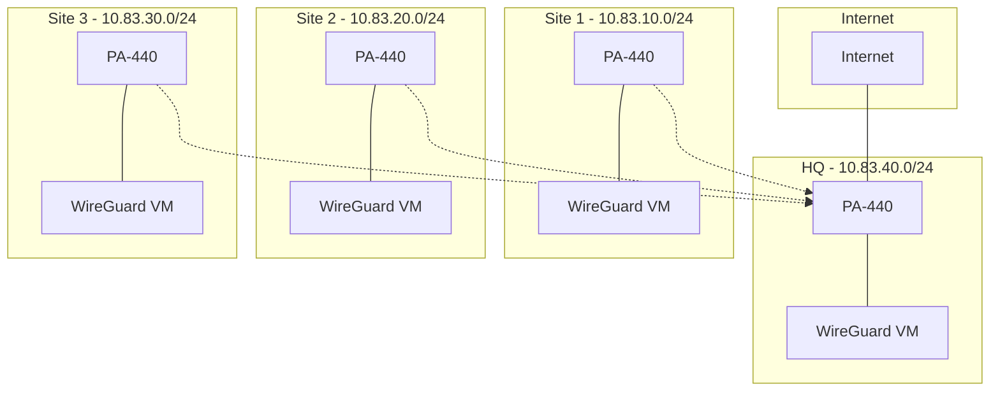

# WireGuard Multi-Site VPN Guide

Setup guide for 3-4 site WireGuard VPN behind PA-440 firewalls, with HQ providing internet for all sites.

## Network Overview



## Prerequisites

- ESXi 7.0+ with Ubuntu 22.04 VMs
- PA-440 firewalls
- UDP 51820 allowed
- Internet at HQ only

## Network Setup

### HQ (10.83.40.0/24)
```
PA-440:
- WAN: [EXTERNAL_IP]
- LAN: 10.83.40.1/24
- DMZ: 10.83.40.2/24

WireGuard VM:
- DMZ: 10.83.40.254/24
```

### Remote Sites (10.83.x0.0/24)
```
PA-440:
- LAN: x0.1/24
- DMZ: x0.2/24

WireGuard VM:
- DMZ: x0.254/24
```

## Configuration Steps

### 1. PA-440 Setup

**HQ PA-440:**
```
1. NAT Rules:
   - Source NAT for all sites
   - Destination NAT for WireGuard

2. Security:
   - Allow WireGuard (UDP/51820)
   - Allow inter-site traffic
   - Allow internet access
```

**Remote PA-440s:**
```
1. Security:
   - Allow WireGuard (UDP/51820)
   - Allow all to HQ
```

### 2. WireGuard Setup

**Install:**
```bash
sudo apt install wireguard
```

**Configure:**
```bash
# Generate keys
wg genkey | sudo tee privatekey | wg pubkey | sudo tee publickey

# Enable forwarding
echo "net.ipv4.ip_forward=1" | sudo tee -a /etc/sysctl.conf
sudo sysctl -p
```

**HQ Config (/etc/wireguard/wg0.conf):**
```ini
[Interface]
PrivateKey = [HQ_PRIVATE_KEY]
Address = 10.83.40.254/32
ListenPort = 51820

[Peer]
PublicKey = [SITE1_PUBLIC_KEY]
AllowedIPs = 10.83.10.0/24

[Peer]
PublicKey = [SITE2_PUBLIC_KEY]
AllowedIPs = 10.83.20.0/24

[Peer]
PublicKey = [SITE3_PUBLIC_KEY]
AllowedIPs = 10.83.30.0/24
```

**Remote Config (/etc/wireguard/wg0.conf):**
```ini
[Interface]
PrivateKey = [SITE_PRIVATE_KEY]
Address = 10.83.x0.254/32
ListenPort = 51820

[Peer]
PublicKey = [HQ_PUBLIC_KEY]
AllowedIPs = 0.0.0.0/0
Endpoint = [HQ_PUBLIC_IP]:51820
PersistentKeepalive = 25
```

### 3. Start WireGuard

```bash
sudo systemctl enable wg-quick@wg0
sudo systemctl start wg-quick@wg0
```

## Testing

```bash
# From remote sites
ping 8.8.8.8          # Internet
ping 10.83.40.254     # HQ
ping 10.83.x0.254     # Other sites

# Check status
sudo wg show
```

## Support

For issues:
1. Check WireGuard status
2. Verify PA-440 rules
3. Test connectivity
4. Check routing

## License

MIT License - see [LICENSE](LICENSE)
