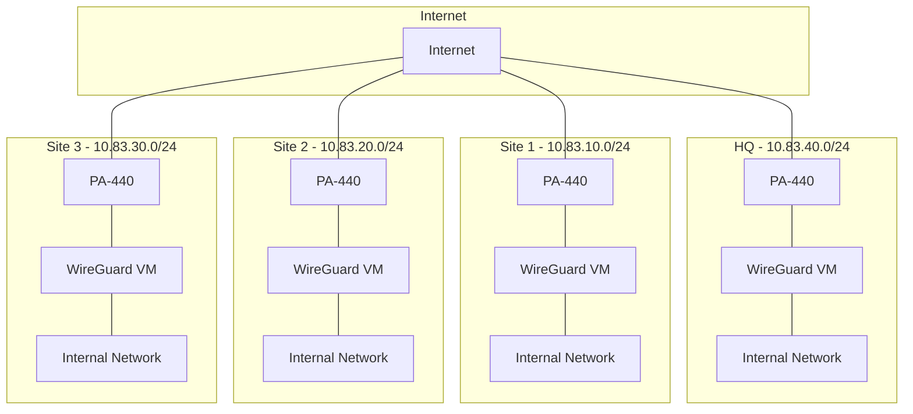

# WireGuard Multi-Site VPN Setup Guide

A comprehensive guide for setting up a 3-4 site WireGuard VPN configuration with Palo Alto PA-440 firewalls in an ESXi environment.

## Overview

This guide provides detailed instructions for implementing a secure site-to-site VPN solution using:
- WireGuard VPN
- Palo Alto PA-440 Firewalls
- VMware ESXi
- Ubuntu Server 22.04 LTS

## Network Architecture



## Prerequisites

1. Hardware Requirements:
   - PA-440 firewall at each site
   - ESXi host with sufficient resources
   - Network connectivity between sites

2. Software Requirements:
   - VMware ESXi (latest stable version)
   - Ubuntu Server 22.04 LTS ISO
   - WireGuard tools
   - SSH client for management

3. Network Requirements:
   - Internet connectivity (at least one site)
   - Dedicated IP ranges for each site
   - Required ports open (UDP 51820)

## Guide Structure

1. [Initial Setup](docs/01-initial-setup.md)
   - ESXi preparation
   - VM creation
   - Ubuntu Server installation

2. [Network Configuration](docs/02-network-configuration.md)
   - Interface setup
   - IP addressing
   - Basic connectivity testing

3. [WireGuard Installation](docs/03-wireguard-installation.md)
   - Package installation
   - Key generation
   - Configuration file setup

4. [PA-440 Configuration](docs/04-paloalto-configuration.md)
   - Interface configuration
   - Security zones
   - NAT rules
   - Security policies

5. [Testing Environment](docs/05-testing-environment.md)
   - Single internet-connected PA-440 setup
   - Network simulation
   - Connectivity validation

6. [Validation and Troubleshooting](docs/06-validation-troubleshooting.md)
   - Connectivity tests
   - Performance validation
   - Common issues and solutions

## Directory Structure

```
.
├── docs\                    # Detailed documentation
│   └── images\             # Network diagrams and screenshots
├── config-templates\        # Configuration templates
│   ├── wireguard\          # WireGuard config templates
│   └── paloalto\           # PA-440 config templates
└── scripts\                # Helper scripts
    ├── setup\              # Setup automation
    └── testing\            # Testing scripts
```

## Configuration Templates

The `config-templates` directory contains:

### WireGuard Templates
- Base configuration templates for each site
- Routing tables
- Interface configurations
- Key generation scripts

### Palo Alto Templates
- Security policies
- NAT rules
- Interface configurations
- Zone configurations
- Route configurations

## Testing Instructions

1. Single Internet-Connected PA-440 Testing:
   - Configure one PA-440 with internet access
   - Connect remaining PA-440s through internal network
   - Validate site-to-site connectivity
   - Test failover scenarios

2. Multi-Site Testing:
   - Verify all site-to-site connections
   - Validate routing tables
   - Test bandwidth and latency
   - Verify security policies

3. Performance Testing:
   - Bandwidth measurements
   - Latency testing
   - Packet loss monitoring
   - Failover timing

## Troubleshooting Guide

Common issues and solutions are documented in [docs/06-validation-troubleshooting.md](docs/06-validation-troubleshooting.md), including:
- Connectivity issues
- Routing problems
- Key management
- Performance optimization
- Security policy troubleshooting

## Maintenance Procedures

1. Regular Tasks:
   - Key rotation
   - Configuration backups
   - Performance monitoring
   - Security updates

2. Emergency Procedures:
   - Failover handling
   - Key compromise response
   - Network recovery
   - System restoration

## Support and Documentation

All documentation is available in the `docs` directory:
- Step-by-step guides
- Configuration examples
- Network diagrams
- Troubleshooting procedures
- Maintenance checklists

## License

This project is licensed under the MIT License - see the [LICENSE](LICENSE) file for details.
