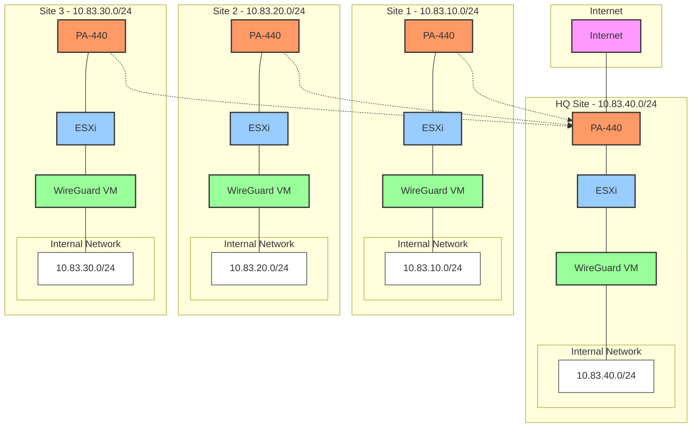

# WireGuard Multi-Site VPN Guide

Step-by-step guide for setting up WireGuard VPN between sites. HQ provides internet for all sites.

## Network Layout



## IP Addresses

**HQ (10.83.40.0/24)**
```
PA-440:
WAN: Your internet IP
LAN: 10.83.40.1
DMZ: 10.83.40.2

WireGuard: 10.83.40.254
```

**Site 1 (10.83.10.0/24)**
```
PA-440:
LAN: 10.83.10.1
DMZ: 10.83.10.2

WireGuard: 10.83.10.254
```

**Site 2 (10.83.20.0/24)**
```
PA-440:
LAN: 10.83.20.1
DMZ: 10.83.20.2

WireGuard: 10.83.20.254
```

**Site 3 (10.83.30.0/24)**
```
PA-440:
LAN: 10.83.30.1
DMZ: 10.83.30.2

WireGuard: 10.83.30.254
```

## Setup Steps

### 1. HQ PA-440 Setup

**Create NAT Rules:**
```
Rule 1: Source NAT (Internet Access)
- Source: Any
- Destination: Any
- Translate: Interface IP

Rule 2: Destination NAT (WireGuard)
- Source: Any
- Destination: Your WAN IP, UDP/51820
- Translate: 10.83.40.254
```

**Create Security Rules:**
```
Rule 1: Allow WireGuard
- Source: Any
- Destination: 10.83.40.254
- Service: UDP/51820
- Action: Allow

Rule 2: Allow Internet
- Source: Any
- Destination: Any
- Action: Allow
```

### 2. Remote PA-440 Setup

**Create Security Rule:**
```
Rule 1: Allow All to HQ
- Source: Any
- Destination: Any
- Action: Allow
```

### 3. WireGuard Setup

**On All Sites:**
```bash
# Install WireGuard
sudo apt update
sudo apt install -y wireguard

# Generate Keys (SAVE THESE!)
cd /etc/wireguard
wg genkey | sudo tee privatekey | wg pubkey | sudo tee publickey
sudo chmod 600 privatekey

# Enable Forwarding
echo "net.ipv4.ip_forward=1" | sudo tee -a /etc/sysctl.conf
sudo sysctl -p
```

### 4. WireGuard Config

**HQ Config File:**
```bash
# Create /etc/wireguard/wg0.conf
[Interface]
PrivateKey = HQ_PRIVATE_KEY
Address = 10.83.40.254/32
ListenPort = 51820

# Site 1
[Peer]
PublicKey = SITE1_PUBLIC_KEY
AllowedIPs = 10.83.10.0/24

# Site 2
[Peer]
PublicKey = SITE2_PUBLIC_KEY
AllowedIPs = 10.83.20.0/24

# Site 3
[Peer]
PublicKey = SITE3_PUBLIC_KEY
AllowedIPs = 10.83.30.0/24
```

**Site 1 Config File:**
```bash
# Create /etc/wireguard/wg0.conf
[Interface]
PrivateKey = SITE1_PRIVATE_KEY
Address = 10.83.10.254/32
ListenPort = 51820

[Peer]
PublicKey = HQ_PUBLIC_KEY
AllowedIPs = 0.0.0.0/0
Endpoint = HQ_PUBLIC_IP:51820
PersistentKeepalive = 25
```

**Site 2 Config File:**
```bash
# Create /etc/wireguard/wg0.conf
[Interface]
PrivateKey = SITE2_PRIVATE_KEY
Address = 10.83.20.254/32
ListenPort = 51820

[Peer]
PublicKey = HQ_PUBLIC_KEY
AllowedIPs = 0.0.0.0/0
Endpoint = HQ_PUBLIC_IP:51820
PersistentKeepalive = 25
```

**Site 3 Config File:**
```bash
# Create /etc/wireguard/wg0.conf
[Interface]
PrivateKey = SITE3_PRIVATE_KEY
Address = 10.83.30.254/32
ListenPort = 51820

[Peer]
PublicKey = HQ_PUBLIC_KEY
AllowedIPs = 0.0.0.0/0
Endpoint = HQ_PUBLIC_IP:51820
PersistentKeepalive = 25
```

### 5. Start WireGuard

**On All Sites:**
```bash
sudo systemctl enable wg-quick@wg0
sudo systemctl start wg-quick@wg0
```

## Testing

**From Remote Sites:**
```bash
# Test Internet
ping 8.8.8.8

# Test HQ
ping 10.83.40.254

# Test Other Sites
ping 10.83.10.254  # Site 1
ping 10.83.20.254  # Site 2
ping 10.83.30.254  # Site 3
```

## Common Problems

1. **No Internet Access**
   - Check HQ NAT rules
   - Verify "AllowedIPs = 0.0.0.0/0" on remote sites
   - Check WireGuard status: `sudo wg show`

2. **Can't Connect**
   - Verify UDP/51820 is allowed
   - Check public/private keys match
   - Verify endpoint IP is correct

3. **Sites Can't See Each Other**
   - Check AllowedIPs includes site networks
   - Verify routing is enabled
   - Check PA-440 security rules

## Quick Fixes

**Restart WireGuard:**
```bash
sudo systemctl restart wg-quick@wg0
```

**Check Status:**
```bash
sudo wg show
sudo systemctl status wg-quick@wg0
```

**View Logs:**
```bash
sudo journalctl -u wg-quick@wg0
