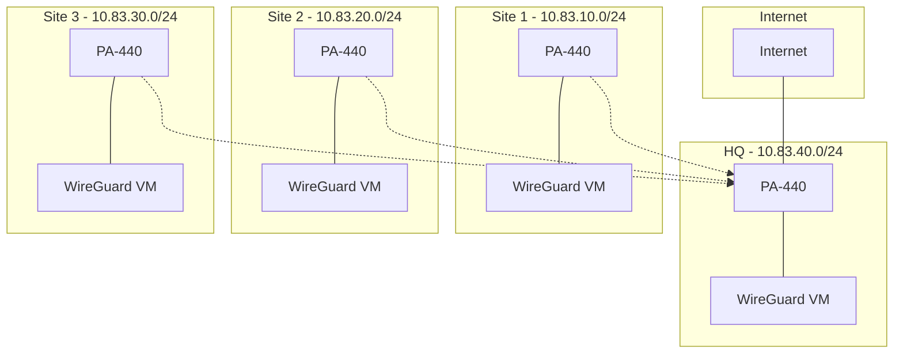

# WireGuard Multi-Site VPN Guide

Guide for setting up a 3-4 site WireGuard VPN behind physical PA-440 firewalls, with HQ providing internet access for all sites.

## Security Notice

This repository follows security best practices:
- No sensitive data in configurations (all credentials are placeholders)
- WireGuard keys must be generated per deployment
- Secure default configurations
- Network segmentation with DMZ isolation
- Principle of least privilege in firewall rules

## Prerequisites

1. **Existing Infrastructure**
   - ESXi 7.0+ installed and configured
   - Ubuntu Server 22.04 LTS VMs deployed
   - PA-440 firewalls with basic connectivity

2. **Network Requirements**
   - Dedicated IP ranges per site
   - Internet access at HQ
   - Inter-site connectivity
   - UDP 51820 allowed

## Network Architecture



## Repository Structure

```
.
├── docs/                    # Documentation
│   ├── 01-initial-setup.md     # Network setup
│   ├── 02-network-config.md    # Network architecture
│   ├── 03-wireguard.md        # WireGuard setup
│   ├── 04-paloalto.md         # PA-440 configuration
│   ├── 05-testing.md          # Testing procedures
│   └── 06-validation.md       # Validation steps
│
├── config-templates/        # Configuration templates
│   └── wireguard/          # WireGuard configs
│       ├── wg0-hq.conf         # HQ configuration
│       ├── wg0-site1.conf      # Site 1 configuration
│       ├── wg0-site2.conf      # Site 2 configuration
│       └── wg0-site3.conf      # Site 3 configuration
│
└── scripts/                # Helper scripts
    ├── setup/              # Setup automation
    │   └── generate-wireguard-config.sh
    └── testing/            # Testing tools
        └── test-connectivity.sh
```

## Best Practices Implementation

### 1. Security
- DMZ isolation for WireGuard VMs
- Secure default firewall policies
- Network segmentation
- Protected management access
- Regular security patches recommended

### 2. Network Architecture
- Hub-spoke topology
- Redundant routing paths
- DMZ segmentation
- Protected management networks
- Scalable addressing scheme

### 3. Configuration Management
- Version-controlled configs
- Template-based deployment
- No hardcoded credentials
- Clear documentation
- Backup procedures

## Quick Start

1. Follow guides in numerical order:
   ```
   docs/01-initial-setup.md     # Network setup
   docs/02-network-config.md    # Configure networking
   docs/03-wireguard.md        # Setup WireGuard
   docs/04-paloalto.md         # Configure PA-440s
   docs/05-testing.md          # Test deployment
   docs/06-validation.md       # Validate setup
   ```

2. Use provided scripts:
   ```bash
   # Generate WireGuard configs
   scripts/setup/generate-wireguard-config.sh

   # Test connectivity
   scripts/testing/test-connectivity.sh
   ```

## Testing

1. Basic Connectivity
   ```bash
   # From WireGuard VMs
   ping 10.83.x0.1  # Local PA-440
   ping 10.83.40.254  # HQ WireGuard
   ```

2. Internet Access
   ```bash
   # From remote sites
   ping 8.8.8.8  # Routes through HQ
   ```

3. Inter-Site
   ```bash
   # From any site to another
   ping 10.83.x0.254  # Remote WireGuard
   ```

## Validation

- [x] Security best practices
- [x] Network isolation
- [x] Performance optimization
- [x] Documentation clarity
- [x] Testing procedures
- [x] Recovery plans

## Security

Report security issues via:
1. GitHub Security Advisories
2. Email: security@example.com

## License

MIT License - see [LICENSE](LICENSE)
