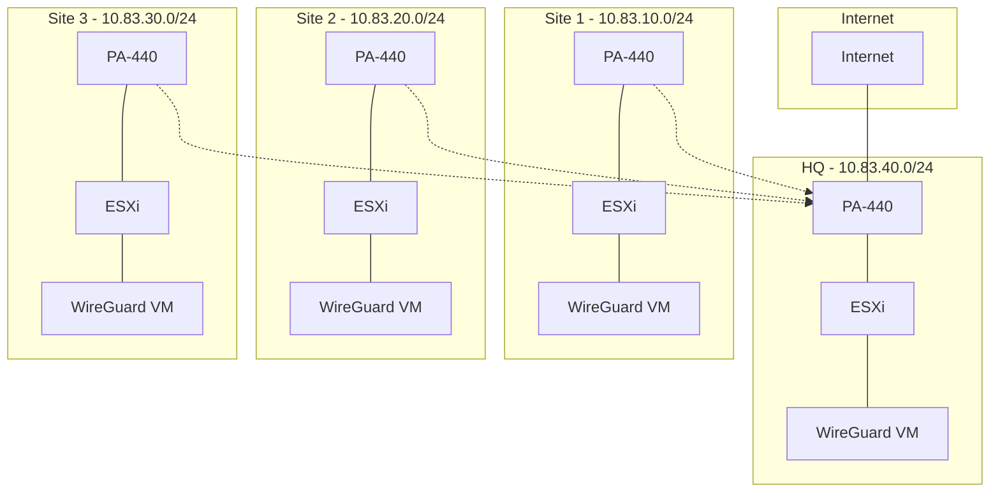

# WireGuard Multi-Site VPN Guide

Guide for setting up a 3-4 site WireGuard VPN behind physical PA-440 firewalls, with HQ providing internet access for all sites.

## Network Overview



## Quick Start

1. **Network Setup**
   - HQ: 10.83.40.0/24 (Internet Gateway)
   - Site 1: 10.83.10.0/24
   - Site 2: 10.83.20.0/24
   - Site 3: 10.83.30.0/24

2. **Per Site Setup**
   ```
   1. Configure PA-440
      - WAN/Internal interface
      - LAN interface (x0.1/24)
      - DMZ interface (x0.2/24)

   2. Setup ESXi
      - Install in protected network
      - Configure DMZ network for WireGuard

   3. Deploy WireGuard VM
      - Ubuntu Server 22.04
      - DMZ IP: x0.254/24
   ```

## Documentation

1. [Initial Setup](docs/01-initial-setup.md)
   - ESXi deployment
   - Ubuntu VM creation

2. [Network Configuration](docs/02-network-configuration.md)
   - IP addressing
   - Network topology
   - PA-440 setup

3. [WireGuard Setup](docs/03-wireguard-installation.md)
   - Installation
   - Configuration
   - Key management

4. [PA-440 Configuration](docs/04-paloalto-configuration.md)
   - Security zones
   - NAT rules
   - Routing

5. [Testing](docs/05-testing-environment.md)
   - Connectivity validation
   - Internet access testing

6. [Troubleshooting](docs/06-validation-troubleshooting.md)
   - Common issues
   - Verification steps

## Configuration Templates

- WireGuard configs in `config-templates/wireguard/`
- Helper scripts in `scripts/`

## Testing

1. **Basic Connectivity**
   ```bash
   # From WireGuard VMs
   ping 10.83.x0.1  # Local PA-440
   ping 10.83.40.254  # HQ WireGuard
   ```

2. **Internet Access**
   ```bash
   # From remote sites
   ping 8.8.8.8  # Should route through HQ
   ```

3. **Inter-Site**
   ```bash
   # From any site to another
   ping 10.83.x0.254  # Remote WireGuard
   ```

## Support

- Check [Troubleshooting](docs/06-validation-troubleshooting.md)
- Use `scripts/testing/test-connectivity.sh`

## License

MIT License - see [LICENSE](LICENSE)
