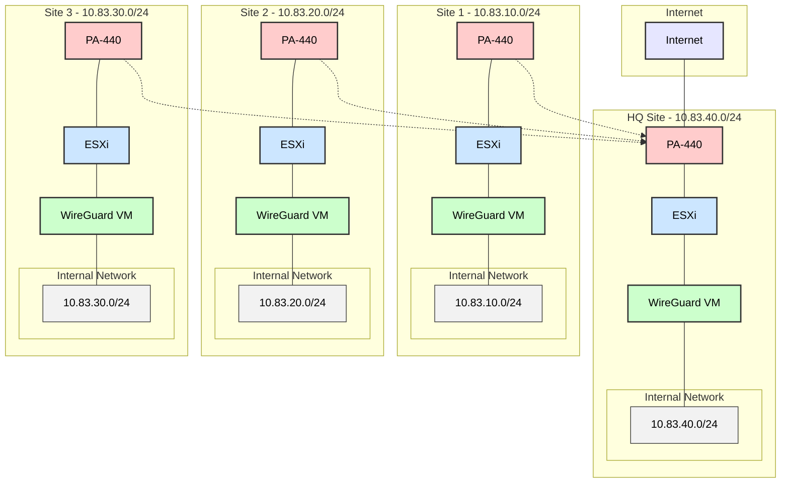

# WireGuard Multi-Site VPN Guide

Step-by-step guide for setting up WireGuard VPN between sites. HQ provides internet for all sites.

## Network Layout



## IP Addresses

**HQ (10.83.40.0/24)**
```
PA-440:
WAN: Your internet IP
LAN: 10.83.40.1
DMZ: 10.83.40.2

WireGuard: 10.83.40.254
```

**Site 1 (10.83.10.0/24)**
```
PA-440:
LAN: 10.83.10.1
DMZ: 10.83.10.2

WireGuard: 10.83.10.254
```

**Site 2 (10.83.20.0/24)**
```
PA-440:
LAN: 10.83.20.1
DMZ: 10.83.20.2

WireGuard: 10.83.20.254
```

**Site 3 (10.83.30.0/24)**
```
PA-440:
LAN: 10.83.30.1
DMZ: 10.83.30.2

WireGuard: 10.83.30.254
```

## VM Setup in ESXi

### Create Ubuntu VM
1. **In ESXi Web Interface:**
   ```
   VM Options:
   - Name: wg-[site]-vpn
   - Guest OS: Ubuntu Linux 64-bit
   - CPU: 2 vCPU
   - RAM: 4GB
   - Disk: 20GB thin provision
   ```

2. **Add Network Adapters:**
   ```
   Adapter 1 (DMZ):
   - Network: DMZ Port Group
   - Adapter Type: VMXNET3

   Adapter 2 (Internal):
   - Network: Internal Port Group
   - Adapter Type: VMXNET3
   ```

### Install Ubuntu Server
1. **Boot from ISO:**
   ```
   - Mount Ubuntu 22.04 LTS ISO
   - Start VM and boot from ISO
   - Select: "Try or Install Ubuntu Server"
   ```

2. **Basic Setup:**
   ```
   Language: English
   Keyboard: US
   Network: Skip (we'll configure later)
   Storage: Use entire disk
   Profile:
     - Name: WireGuard Admin
     - Server name: wg-[site]-vpn
     - Username: wgadmin
     - Password: [Strong Password]
   SSH: Install OpenSSH server
   ```

3. **Network Setup:**
   ```bash
   # Edit Netplan config
   sudo nano /etc/netplan/00-installer-config.yaml

   # Add configuration:
   network:
     version: 2
     ethernets:
       ens160:  # DMZ Interface
         dhcp4: no
         addresses: [DMZ_IP/24]
         routes:
           - to: default
             via: [PA440_DMZ_IP]
         nameservers:
           addresses: [DNS_SERVERS]
       ens192:  # Internal Interface
         dhcp4: no
         addresses: [INTERNAL_IP/24]

   # Apply config
   sudo netplan try
   sudo netplan apply
   ```

## Setup Steps

### 1. HQ PA-440 Setup

**Create NAT Rules:**
```
Rule 1: Source NAT (Internet Access)
- Source: Any
- Destination: Any
- Translate: Interface IP

Rule 2: Destination NAT (WireGuard)
- Source: Any
- Destination: Your WAN IP, UDP/51820
- Translate: 10.83.40.254
```

**Create Security Rules:**
```
Rule 1: Allow WireGuard
- Source: Any
- Destination: 10.83.40.254
- Service: UDP/51820
- Action: Allow

Rule 2: Allow Internet
- Source: Any
- Destination: Any
- Action: Allow
```

### 2. Remote PA-440 Setup

**Create Security Rule:**
```
Rule 1: Allow All to HQ
- Source: Any
- Destination: Any
- Action: Allow
```

### 3. WireGuard Setup

**On All Sites:**
```bash
# Install WireGuard
sudo apt update
sudo apt install -y wireguard

# Generate Keys (SAVE THESE!)
cd /etc/wireguard
wg genkey | sudo tee privatekey | wg pubkey | sudo tee publickey
sudo chmod 600 privatekey

# Enable Forwarding
echo "net.ipv4.ip_forward=1" | sudo tee -a /etc/sysctl.conf
sudo sysctl -p
```

### 4. WireGuard Config

**HQ Config File:**
```bash
# Create /etc/wireguard/wg0.conf
[Interface]
PrivateKey = HQ_PRIVATE_KEY
Address = 10.83.40.254/32
ListenPort = 51820

# Site 1
[Peer]
PublicKey = SITE1_PUBLIC_KEY
# Allow traffic to Site 1's network
AllowedIPs = 10.83.10.0/24

# Site 2
[Peer]
PublicKey = SITE2_PUBLIC_KEY
# Allow traffic to Site 2's network
AllowedIPs = 10.83.20.0/24

# Site 3
[Peer]
PublicKey = SITE3_PUBLIC_KEY
# Allow traffic to Site 3's network
AllowedIPs = 10.83.30.0/24
```

**Site 1 Config File:**
```bash
# Create /etc/wireguard/wg0.conf
[Interface]
PrivateKey = SITE1_PRIVATE_KEY
Address = 10.83.10.254/32
ListenPort = 51820

[Peer]
PublicKey = HQ_PUBLIC_KEY
# Allow traffic to HQ and all other sites
AllowedIPs = 10.83.0.0/16  # Covers all site networks (10.83.x0.0/24)
Endpoint = HQ_PUBLIC_IP:51820
PersistentKeepalive = 25
```

**Site 2 Config File:**
```bash
# Create /etc/wireguard/wg0.conf
[Interface]
PrivateKey = SITE2_PRIVATE_KEY
Address = 10.83.20.254/32
ListenPort = 51820

[Peer]
PublicKey = HQ_PUBLIC_KEY
# Allow traffic to HQ and all other sites
AllowedIPs = 10.83.0.0/16  # Covers all site networks (10.83.x0.0/24)
Endpoint = HQ_PUBLIC_IP:51820
PersistentKeepalive = 25
```

**Site 3 Config File:**
```bash
# Create /etc/wireguard/wg0.conf
[Interface]
PrivateKey = SITE3_PRIVATE_KEY
Address = 10.83.30.254/32
ListenPort = 51820

[Peer]
PublicKey = HQ_PUBLIC_KEY
# Allow traffic to HQ and all other sites
AllowedIPs = 10.83.0.0/16  # Covers all site networks (10.83.x0.0/24)
Endpoint = HQ_PUBLIC_IP:51820
PersistentKeepalive = 25
```

### 5. Start WireGuard

**On All Sites:**
```bash
sudo systemctl enable wg-quick@wg0
sudo systemctl start wg-quick@wg0
```

## Traffic Flow

### Internet Access
```
Remote Site -> HQ -> Internet
Example: 10.83.10.0/24 -> 10.83.40.254 -> Internet
```

### Site-to-Site Access
```
Site 1 -> HQ -> Site 2
Example: 10.83.10.0/24 -> 10.83.40.254 -> 10.83.20.0/24

Site 2 -> HQ -> Site 3
Example: 10.83.20.0/24 -> 10.83.40.254 -> 10.83.30.0/24

Site 3 -> HQ -> Site 1
Example: 10.83.30.0/24 -> 10.83.40.254 -> 10.83.10.0/24
```

### Access Summary
- HQ can reach all sites directly (10.83.10.0/24, 10.83.20.0/24, 10.83.30.0/24)
- All sites can reach each other through HQ
- All sites can reach the internet through HQ
- All traffic between sites is encrypted

## Testing

**From Remote Sites:**
```bash
# Test Internet
ping 8.8.8.8

# Test HQ
ping 10.83.40.254

# Test Other Sites
ping 10.83.10.254  # Site 1
ping 10.83.20.254  # Site 2
ping 10.83.30.254  # Site 3

# Test Full Connectivity
for ip in 10.83.{10,20,30,40}.254; do
    echo "Testing connection to $ip..."
    ping -c 4 $ip
done
```

## Common Problems

1. **No Internet Access**
   - Check HQ NAT rules
   - Verify "AllowedIPs = 0.0.0.0/0" on remote sites
   - Check WireGuard status: `sudo wg show`

2. **Can't Connect**
   - Verify UDP/51820 is allowed
   - Check public/private keys match
   - Verify endpoint IP is correct

3. **Sites Can't See Each Other**
   - Check AllowedIPs includes site networks (10.83.0.0/16)
   - Verify routing is enabled
   - Check PA-440 security rules
   - Verify HQ is forwarding traffic between sites

## Quick Fixes

**Restart WireGuard:**
```bash
sudo systemctl restart wg-quick@wg0
```

**Check Status:**
```bash
sudo wg show
sudo systemctl status wg-quick@wg0
```

**View Logs:**
```bash
sudo journalctl -u wg-quick@wg0
```

**Verify Routing:**
```bash
# Check routes
ip route show

# Monitor traffic
sudo tcpdump -i wg0 -n

# Check forwarding
cat /proc/sys/net/ipv4/ip_forward
