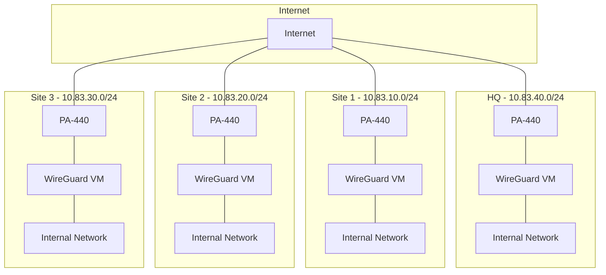
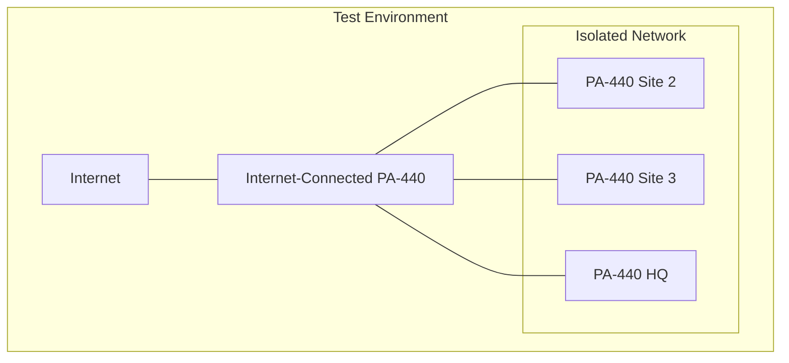

# System Architecture and Design Patterns

## Network Architecture

## Key Design Patterns

### 1. Network Segmentation
- Each site maintains its own /24 network
- Clear separation between WireGuard and internal networks
- Standardized addressing scheme across all sites

### 2. Security Architecture
- PA-440 firewalls as primary security boundary
- WireGuard for encrypted site-to-site tunnels
- Isolated VM networks for WireGuard servers

### 3. Virtualization Pattern
- ESXi-hosted Ubuntu VMs
- Dedicated network interfaces for:
  - WireGuard tunnel traffic
  - Internal network communication
  - Management access

### 4. Routing Architecture
- Full mesh WireGuard topology
- Static routes for known networks
- NAT handling at PA-440 boundaries

### 5. Testing Pattern

## Implementation Patterns

### 1. WireGuard Configuration
- Standardized config file structure
- Consistent key management
- Unified routing tables

### 2. PA-440 Configuration
- Standardized security policies
- Consistent NAT rules
- Uniform routing configuration

### 3. Monitoring Pattern
- Health checks between sites
- Bandwidth monitoring
- Latency tracking
- Connection state monitoring

### 4. Backup Pattern
- Configuration backups
- Key backups
- Recovery procedures

### 5. Documentation Pattern
- Step-by-step guides
- Configuration templates
- Troubleshooting flowcharts
- Validation checklists
