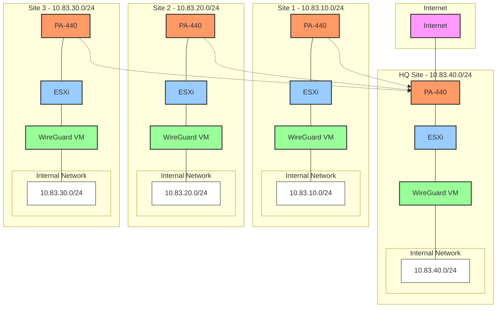
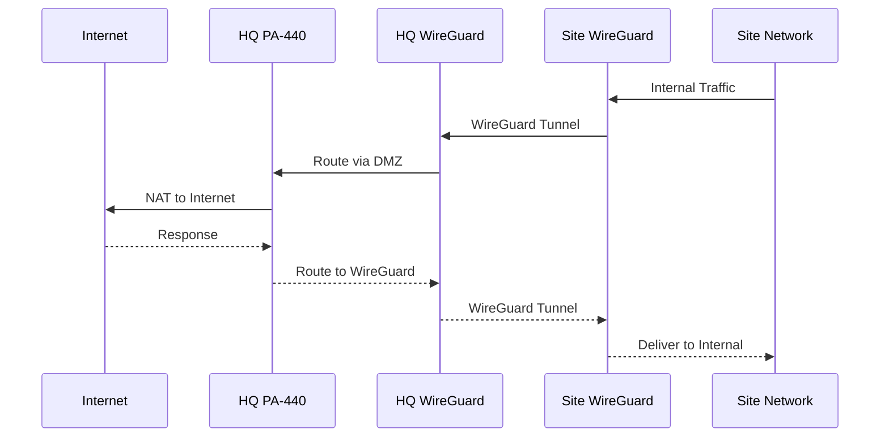
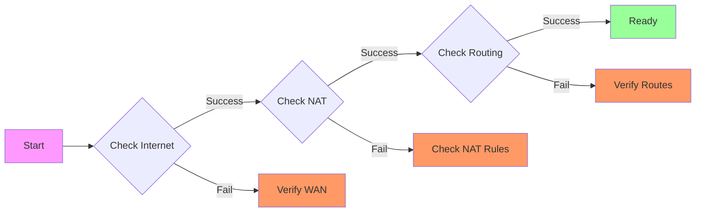
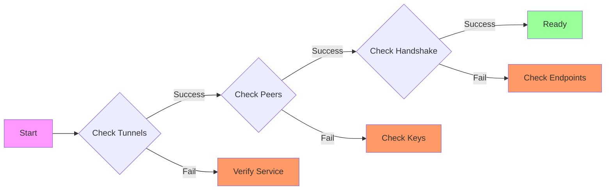
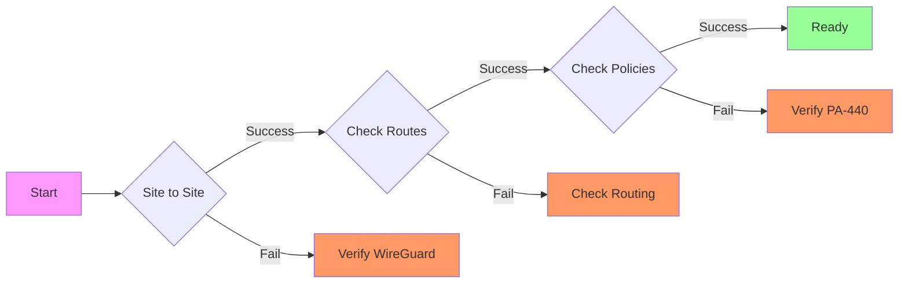

# Testing Environment Guide

Guide for validating the WireGuard VPN setup in a test environment where only HQ has internet access.

## Table of Contents
- [Table of Contents](#table-of-contents)
- [Test Environment Architecture](#test-environment-architecture)
- [Network Flow](#network-flow)
- [Validation Steps](#validation-steps)
  - [1. Internet Gateway (HQ)](#1-internet-gateway-hq)
  - [2. WireGuard Tunnels](#2-wireguard-tunnels)
  - [3. Inter-Site Communication](#3-inter-site-communication)
- [Performance Testing](#performance-testing)
  - [1. Bandwidth Test](#1-bandwidth-test)
  - [2. Latency Test](#2-latency-test)
  - [3. Full Path Test](#3-full-path-test)
- [Validation Checklist](#validation-checklist)
  - [HQ Site](#hq-site)
  - [Remote Sites](#remote-sites)
  - [Performance](#performance)

## Test Environment Architecture



## Network Flow



## Validation Steps

### 1. Internet Gateway (HQ)



Commands:
```bash
# Internet Connectivity
ping -c 4 8.8.8.8

# NAT Verification
sudo tcpdump -i any port 53

# Routing Check
ip route show
traceroute 8.8.8.8
```

### 2. WireGuard Tunnels



Commands:
```bash
# Check WireGuard Status
sudo wg show

# Verify Connectivity
ping -c 4 10.83.40.254  # To HQ
ping -c 4 10.83.10.254  # To Site 1
ping -c 4 10.83.20.254  # To Site 2
ping -c 4 10.83.30.254  # To Site 3

# Monitor Traffic
sudo tcpdump -i wg0 -n
```

### 3. Inter-Site Communication



Commands:
```bash
# Test Site Connectivity
for site in 10 20 30 40; do
    echo "Testing 10.83.${site}.0/24"
    ping -c 4 10.83.${site}.254
done

# Trace Routes
for site in 10 20 30 40; do
    echo "Tracing to 10.83.${site}.0/24"
    traceroute 10.83.${site}.254
done
```

## Performance Testing

### 1. Bandwidth Test
```bash
# On Server (HQ)
iperf3 -s

# On Clients (Remote Sites)
iperf3 -c 10.83.40.254 -t 30
```

### 2. Latency Test
```bash
# From Each Site
for site in 10 20 30 40; do
    echo "Testing latency to 10.83.${site}.254"
    ping -c 100 10.83.${site}.254 | tail -1
done
```

### 3. Full Path Test
```bash
# From Remote Sites
mtr -n -c 100 8.8.8.8
mtr -n -c 100 10.83.40.254
```

## Validation Checklist

### HQ Site
- [ ] Internet access (ping 8.8.8.8)
- [ ] NAT working (tcpdump shows translated traffic)
- [ ] WireGuard tunnels established (wg show)
- [ ] Routes to all sites present (ip route show)

### Remote Sites
- [ ] WireGuard tunnel to HQ (ping 10.83.40.254)
- [ ] Internet access through HQ (ping 8.8.8.8)
- [ ] Inter-site connectivity (ping other sites)
- [ ] Default route via WireGuard (ip route show)

### Performance
- [ ] Latency < 100ms to HQ
- [ ] Bandwidth > 10Mbps
- [ ] No packet loss
- [ ] Stable tunnels (wg show)
