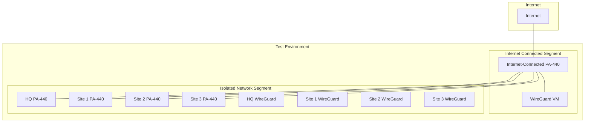

# Testing Environment Setup Guide

This guide covers setting up a test environment for the WireGuard VPN configuration where only one PA-440 has internet access. This setup allows validation of the full configuration before deployment.

## Test Environment Overview



## Prerequisites

- ESXi host with sufficient resources
- 5x PA-440 firewalls
- 5x Ubuntu Server VMs
- Network switches for isolation
- Console access to all devices

## Network Setup

### 1. Network Segmentation

#### Internet-Connected Segment
```
WAN Network: [ISP_NETWORK]
Internal Network: 192.168.1.0/24
```

#### Isolated Network Segment
```
HQ Network: 10.83.40.0/24
Site 1 Network: 10.83.10.0/24
Site 2 Network: 10.83.20.0/24
Site 3 Network: 10.83.30.0/24
Test Management Network: 172.16.0.0/24
```

### 2. VLAN Configuration

```
VLAN 10: Internet-Connected Segment
VLAN 20: HQ Network
VLAN 30: Site 1 Network
VLAN 40: Site 2 Network
VLAN 50: Site 3 Network
VLAN 99: Management Network
```

## Internet-Connected PA-440 Setup

### 1. Interface Configuration

```
ethernet1/1 (WAN):
  Zone: WAN
  Type: Layer3
  IP: [ISP_PROVIDED_IP]

ethernet1/2 (Internal):
  Zone: INTERNAL
  Type: Layer3
  IP: 192.168.1.1/24

ethernet1/3-6 (Site Links):
  Zone: SITES
  Type: Layer3
  IPs:
    - HQ: 172.16.0.1/24
    - Site1: 172.16.1.1/24
    - Site2: 172.16.2.1/24
    - Site3: 172.16.3.1/24
```

### 2. NAT Configuration

```
WAN Outbound NAT:
  Source: Any
  Destination: Any
  Translation: Interface IP

Site Access NAT:
  Source: 172.16.0.0/16
  Destination: Any
  Translation: Interface IP
```

### 3. Security Policies

```
Allow Internet Access:
  Source: SITES
  Destination: WAN
  Service: Any
  Action: Allow

Allow Inter-Site:
  Source: SITES
  Destination: SITES
  Service: Any
  Action: Allow
```

## Isolated PA-440s Setup

### 1. Basic Configuration

For each site's PA-440:
```
Management:
  IP: 172.16.x.1/24 (x = site number)
  Gateway: 172.16.0.1

WAN Interface:
  Connect to: Internet-Connected PA-440
  IP: 172.16.x.2/24

Internal Interface:
  IP: 10.83.x0.1/24
```

### 2. Routing Configuration

```
Default Route:
  Destination: 0.0.0.0/0
  Next-hop: 172.16.x.1

Internal Routes:
  Per site network requirements
```

## WireGuard VM Configuration

### 1. Internet-Connected VM

```
Interface Configuration:
  ens160 (WAN): DHCP from 192.168.1.0/24
  ens192 (Internal): 192.168.1.254/24

WireGuard Configuration:
  Listen Port: 51820
  Endpoint: [ISP_PROVIDED_IP]
```

### 2. Isolated VMs

```
Interface Configuration:
  ens160 (WAN): Static IP from site network
  ens192 (Internal): Static IP from site network

WireGuard Configuration:
  Listen Port: 51820
  Endpoint: [INTERNET_CONNECTED_VM_IP]
```

## Testing Procedures

### 1. Basic Connectivity

```bash
# From each isolated PA-440
ping 172.16.0.1  # Internet-Connected PA-440
ping 8.8.8.8     # Internet connectivity

# From each WireGuard VM
ping [NEXT_HOP]
ping 8.8.8.8
```

### 2. WireGuard Connectivity

```bash
# From each WireGuard VM
wg show
ping [PEER_WIREGUARD_IP]
```

### 3. End-to-End Testing

```bash
# From each site's internal network
ping [REMOTE_SITE_INTERNAL_IP]
traceroute [REMOTE_SITE_INTERNAL_IP]
```

### 4. Performance Testing

```bash
# Install iperf3 on test endpoints
sudo apt install iperf3

# On server
iperf3 -s

# On client
iperf3 -c [SERVER_IP]
```

## Validation Checklist

### 1. Internet Access
- [ ] Internet-Connected PA-440 can reach internet
- [ ] All sites can reach internet through main PA-440
- [ ] DNS resolution works for all sites

### 2. WireGuard Connectivity
- [ ] All WireGuard tunnels established
- [ ] Tunnel statistics show traffic flow
- [ ] Ping times within acceptable range

### 3. Internal Routing
- [ ] All sites can reach each other
- [ ] Route paths are correct
- [ ] No routing loops present

### 4. Security Policies
- [ ] Traffic properly NAT'd
- [ ] Security policies enforced
- [ ] Logging working correctly

## Troubleshooting Tools

### 1. Network Validation
```bash
# Check connectivity
ping -c 4 [TARGET_IP]
traceroute [TARGET_IP]
mtr [TARGET_IP]

# Check routing
ip route show
ip route get [TARGET_IP]
```

### 2. WireGuard Diagnostics
```bash
# Check tunnel status
sudo wg show all
sudo systemctl status wg-quick@wg0

# Monitor traffic
sudo tcpdump -i wg0
```

### 3. PA-440 Diagnostics
```
# Show interfaces
> show interface all

# Show routing
> show routing route

# Show NAT
> show nat all

# Debug traffic
> debug dataplane packet-diag
```

## Common Issues and Solutions

### 1. Connectivity Issues
- Check physical connections
- Verify IP addressing
- Confirm routing configuration
- Test with ping and traceroute

### 2. Tunnel Problems
- Verify WireGuard configurations
- Check NAT rules
- Confirm port forwarding
- Test with tcpdump

### 3. Routing Issues
- Verify static routes
- Check next-hop availability
- Confirm no routing loops
- Test with traceroute

### 4. Performance Issues
- Test with iperf3
- Check MTU settings
- Monitor CPU and memory
- Verify no packet loss

## Test Scenario Matrix

| Test Case | Description | Expected Result |
|-----------|-------------|-----------------|
| Internet Access | Test internet connectivity from each site | All sites can reach internet |
| Inter-Site Routing | Test connectivity between all sites | All sites can reach each other |
| Failover | Disable primary connection | Traffic fails over correctly |
| Performance | Run iperf3 tests | Meets bandwidth requirements |
| Security | Test security policies | Policies enforce correctly |

## Next Steps

After completing this guide:
1. Document all test results
2. Address any issues found
3. Prepare for production deployment
4. Proceed to [Validation and Troubleshooting](06-validation-troubleshooting.md)
